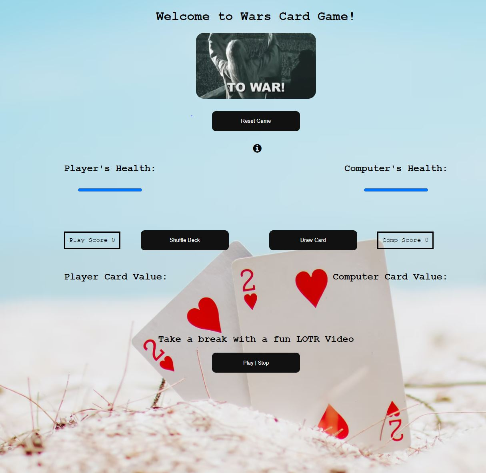

# Cards War Game

A simple web application based on the War card game where you will play against the computer using the Card API. War relies entirely on the luck of the draw and involves no strategic elements. Originaly each player turns up a card at the same time and the player with the higher card takes both cards and puts them under his deck. In the original game the purpose of the game is to win all the cards from the other player. Playing the game in the original format could take from 10-40 minutes. Therefore I have crafted my own version of the card game wars.

A deck will be shuffled and split evenly between two players. whoever has the higher card gains 1 point. In the case you and the computer draw the same card value. Both will draw another set of cards and whoever wins the round after the draw will recieve 3 Points! The computer and player will start off with 20 health points at the beginning of the game. In the end of a set of 26 card draws, the difference in score will determine how much health the player or computer lose depending on who got a lower score at the end of a set of cards. You will be able to play through multiple sets of card until you, the player or computer lose all your health points.

## Technologies used
- HTML5
- CSS3
- JavaScript
- JQuery
- Card Deck Api

## Screenshots
- "Starting View"

- "View after you shuffle a deck and start"

- "Veiw of middle of game"

## Getting Started
 - Wars Card Game Guide:            
1. The game starts off with a shuffled deck of 52 cards.
2. To start the game press the Shuffle Cards button!
3. There are 26 card draws in a set using the draw card button.
4. To earn points you will have to play a higher card than the computer.
5. If You and the computer get the same card value you will draw another set of cards and whoever wins the round after the draw will get 3 Points!
6. You and the Computer will have 20 Health Points at the start of the game. At the end of each set of cards the difference in points will determine how much health is lost for whoever lost the round.
7. The Goal is to get the computers health points to 0 and Win the game.
8. Good Luck!
            
  https://danielw-war-card-game-app.netlify.app/

## Future Enhancements
- Update the Design of the application.
- Add new features such as a betting system.
